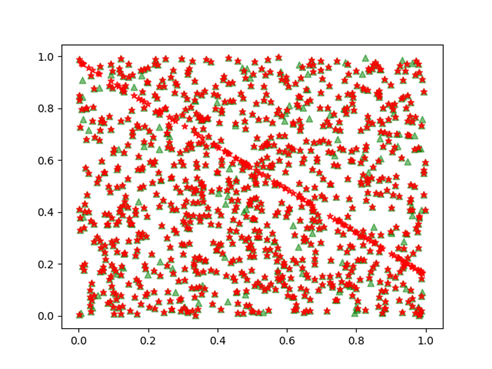
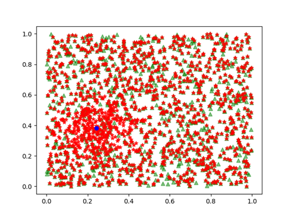
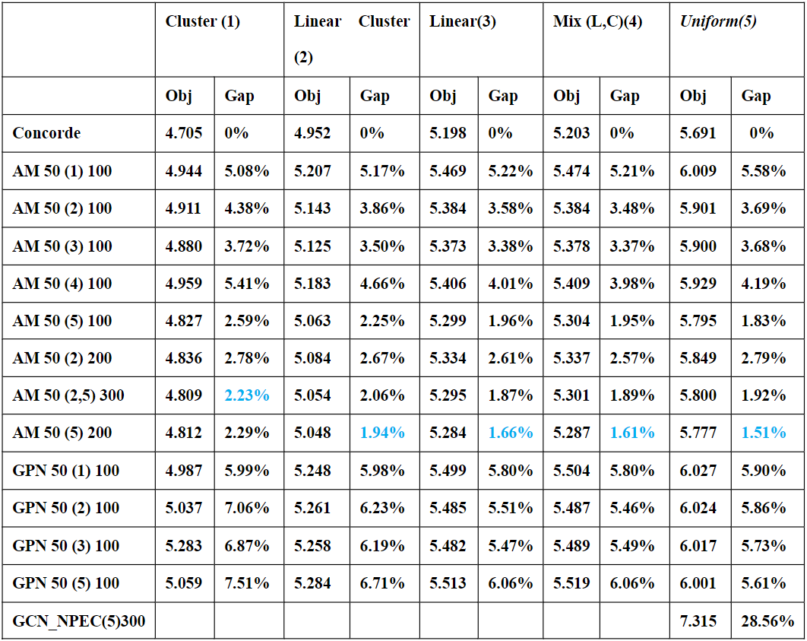
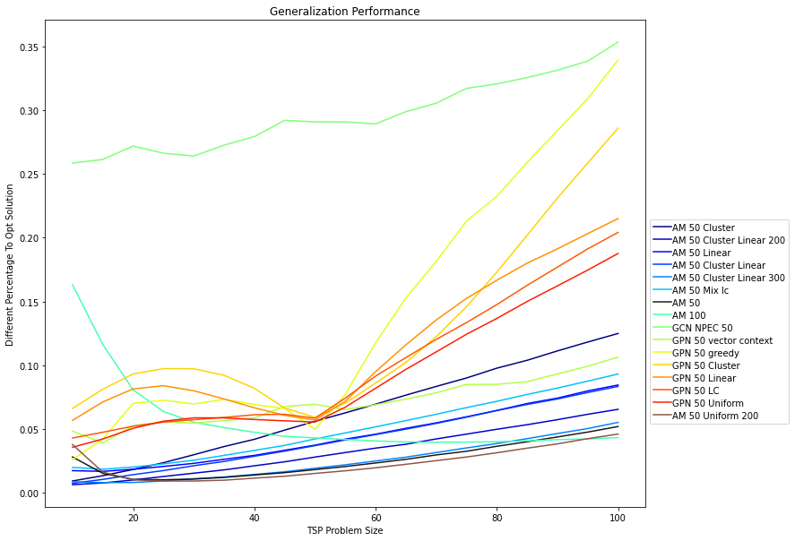
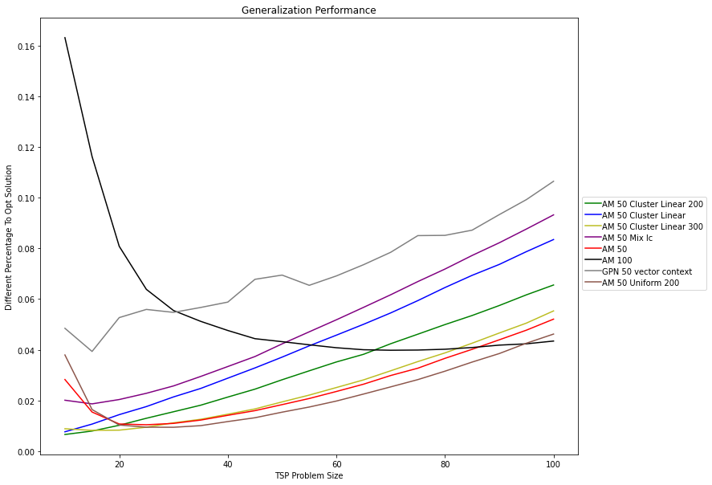
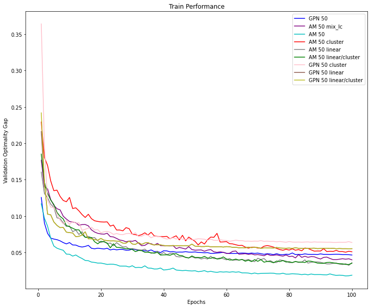
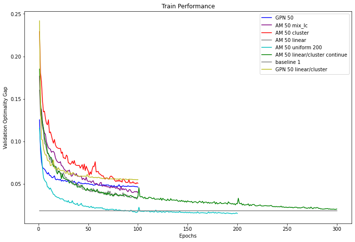
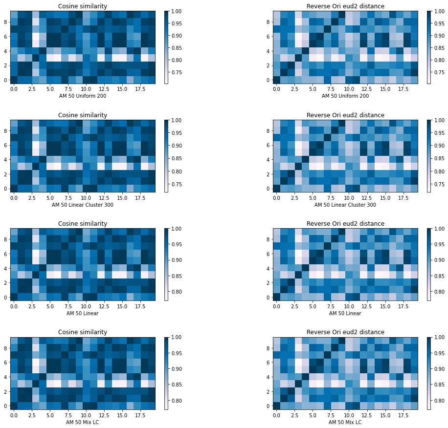

# Reproduction and Generalization Performance Test of Neural Solver for TSP

Testing the generalization and solving performance of the neural solver for TSP based on the paper. In this experiment, I started from the reproduction of three classic models (AM, GPN, GCN NPEC ) in this field, I replaced the training data and test data with the data generated by the genetic algorithm, explored their generalization and solution performance, and tried to analyze the reasons behind them. This experiment finally completed the training of three classic models, completed the performance test based on self-generated data and made a simple analysis of the counter-intuitive results

You can see the report of three defense [here](https://github.com/Antoniano1963/TSP-Solver-Analyze/tree/master/report) 

## Model

- AM [ATTENTION, LEARN TO SOLVE ROUTING PROBLEMS!](https://arxiv.org/abs/1803.08475) 
- GPN [Combinatorial Optimization by Graph Pointer Networks and Hierarchical Reinforcement Learning](https://arxiv.org/abs/1911.04936)
- GCN_NPEC [Efficiently Solving the Practical Vehicle Routing Problem: A Novel Joint Learning Approach](https://dl.acm.org/doi/abs/10.1145/3394486.3403356?casa_token=tPE7GdjZi2oAAAAA:5M0bIXpTWDtz_0RuF6TF-Df1ur89RqUswqAFQ6pN2quUcq1VIKPQ2TC0JN3grEG9XGJKv1PyfvZQWA)

We mainly tested the TSP-related parts of the AM model and the GPN model. The relevant part of the GPN model regarding TSP with time window is not in our testing scope. GCN_NPEC focuses on solving the VRP problem, which we reproduce but do not achieve the results mentioned in the paper. We simply tested it by transforming the TSP problem into a VRP problem.

## Dataset

The dataset is generated based on the paper [Evolving Diverse TSP Instances by Means of Novel and Creative Mutation Operators](https://dl.acm.org/doi/abs/10.1145/3299904.3340307?casa_token=iuuLHRMcibkAAAAA:xlMAsglmrcF6i3oi0K_p9R3_0Z0Z1b4qwG3zd7feume01rblyo77Cb3NXndbT8xcG31Z3UQ37NlX-Q)

We used the Linear Projection and Cluster mutation operators to generate training and test data.

Figure1 The effect of Linear Projection operator at n=1500

Figure2 The effect of Cluster operator at n=1500

| **Problem set**       | **Data size** | **Mutation**           | **Problem Size** |
| --------------------- | ------------- | ---------------------- | ---------------- |
| **Cluster(1)**        | **320000**    | **Cluster**            | **50**           |
| **Linear Cluster(2)** | **320000**    | **L/C combination**    | **50**           |
| **Linear(3)**         | **320000**    | **Linear**             | **50**           |
| **Mix(L,C)(4)**       | **320000**    | **Linear and Cluster** | **50**           |
| **Uniform(5)**        | **320000**    | **None**               | **50**           |

Table1 Introduction to the datasets

## Experiment Result

#### Solving Performance Test

The solving performance of AM, GPN and GCN_NPEC is tested using self-generated datasets. Using concorde to get baseline.

Table2 Solving performance of AM, GPN, GCN_NPEC trained with different training datasets. Among them, Obj is the optimal solution of the model, and Gap is the gap (percentage) between the optimal solution of the model and the historical optimal solution.

#### Generalization Performance Test

The experiment compared Generalization Performance of different model. Using the data in the size of Graph size = [10, 15, 20, 25, 30, 35, 40, 45, 50, 55, 60, 65, 75, 80, 85, 90, 95, 100] to get the Generalization Performance.

Generalization performance test of different models on datasets of different sizes   Figure3

Generalization performance test of different models(The model which performance good) on datasets of different sizes    Figure4

#### Training Performance with different dataset

In this experiment, the performance of AM and GPN models trained with different datasets is shown with the increase of training rounds.

The training effect of the model under different datasets. The horizontal axis of the picture is the training rounds, and the vertical axis is the percentage gap between the solution of the model on the test set and the Baseline   Figure5

The training effect of the model under different data sets The horizontal axis of the picture is the training round, and the vertical axis is the percentage gap between the solution of the model on the test set and the Baseline (Add the performance of the model with continued training)   Figure6</pr>

#### AM Position Embedding Experiment

Prove that the cosine similarity of the AM model position embedding is related to the actual Euclidean distance

Comparison of Cosine Similarity of different model's position embedding and EUD2 Distance   Figure7

